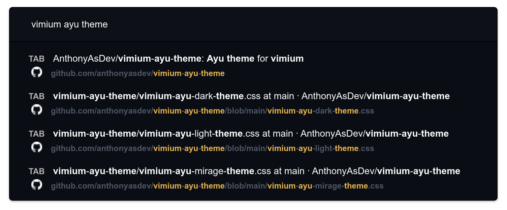
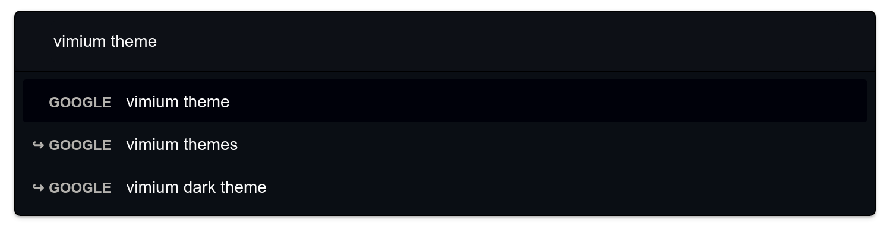
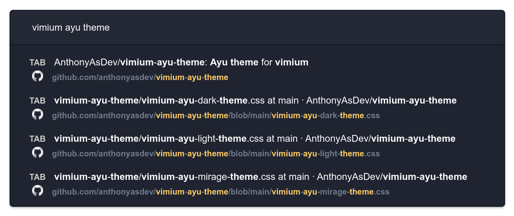
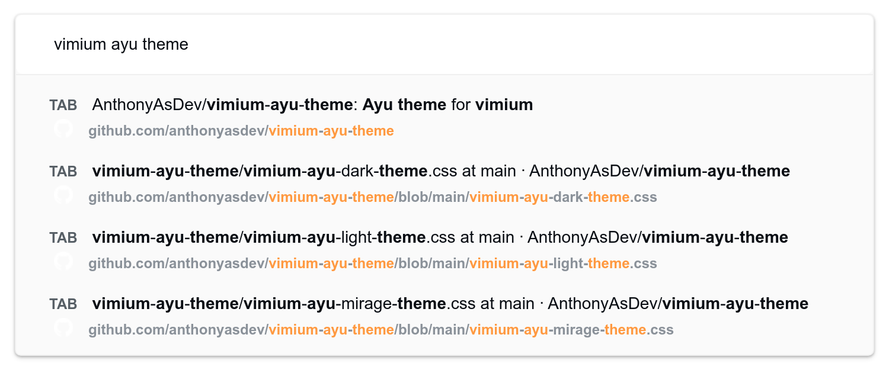

# Vimium Ayu Theme
Ayu theme for vimium

## Vomnibar
### Ayu Dark

### Ayu Mirage

### Ayu Light

## Hints

 

[VimiumChromeExtension]: https://chrome.google.com/webstore/detail/vimium/dbepggeogbaibhgnhhndojpepiihcmeb/
[VimiumFirefoxExtension]: https://addons.mozilla.org/en-US/firefox/addon/vimium-ff/
[OperaInstallChrome]: https://addons.opera.com/en/extensions/details/install-chrome-extensions/

## Install vimium

### Chrome Browser
> 1. Install Chrome Browser
> 2. Download the extension _[Vimium][VimiumChromeExtension]_ from the _Chrome Web Store_
> 3. Add the ayu theme for vimium

### Brave Web Browser
> 1. Install Brave Web Browser
> 2. Download the extension _[Vimium][VimiumChromeExtension]_ from the _Chrome Web Store_
> 3. Add the ayu theme for vimium

### Opera Browser
> 1. Install Opera Browser
> 2. Download the extension _[Install Chrome Extensions][OperaInstallChrome]_ from the _Opera add-ons_
> 3. Download the extension _[Vimium][VimiumChromeExtension]_ from the _Chrome Web Store_
> 4. Add the ayu theme for vimium

### Firefox Web Browser
> 1. Install Firefox Web Browser
> 2. Download the extension _[Vimium][VimiumFirefoxExtension]_ from the _Firefox add-ons_
> 3. Add the ayu theme for vimium

## How to customize vimium
Open the Vimium options and add the content of any of the themes in _CSS for Vimium UI_:

- **[Ayu Dark](https://github.com/AnthonyAsDev/vimium-ayu-theme/blob/main/vimium-ayu-dark-theme.css)**  
- **[Ayu Mirage](https://github.com/AnthonyAsDev/vimium-ayu-theme/blob/main/vimium-ayu-mirage-theme.css)**  
- **[Ayu Light](https://github.com/AnthonyAsDev/vimium-ayu-theme/blob/main/vimium-ayu-light-theme.css)**  

